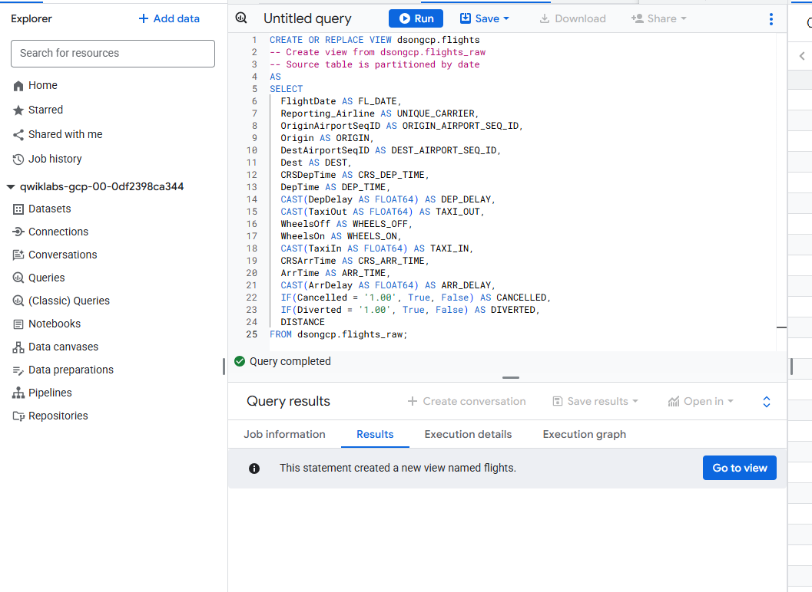
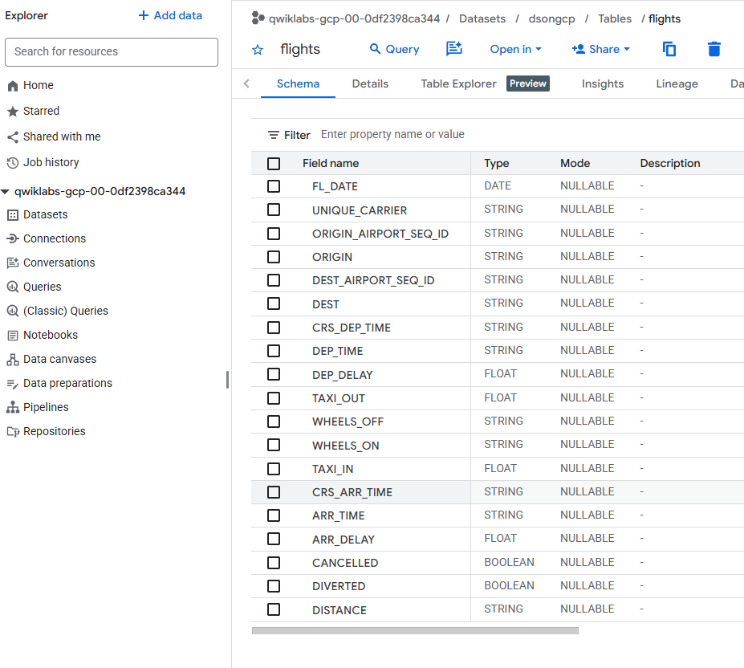
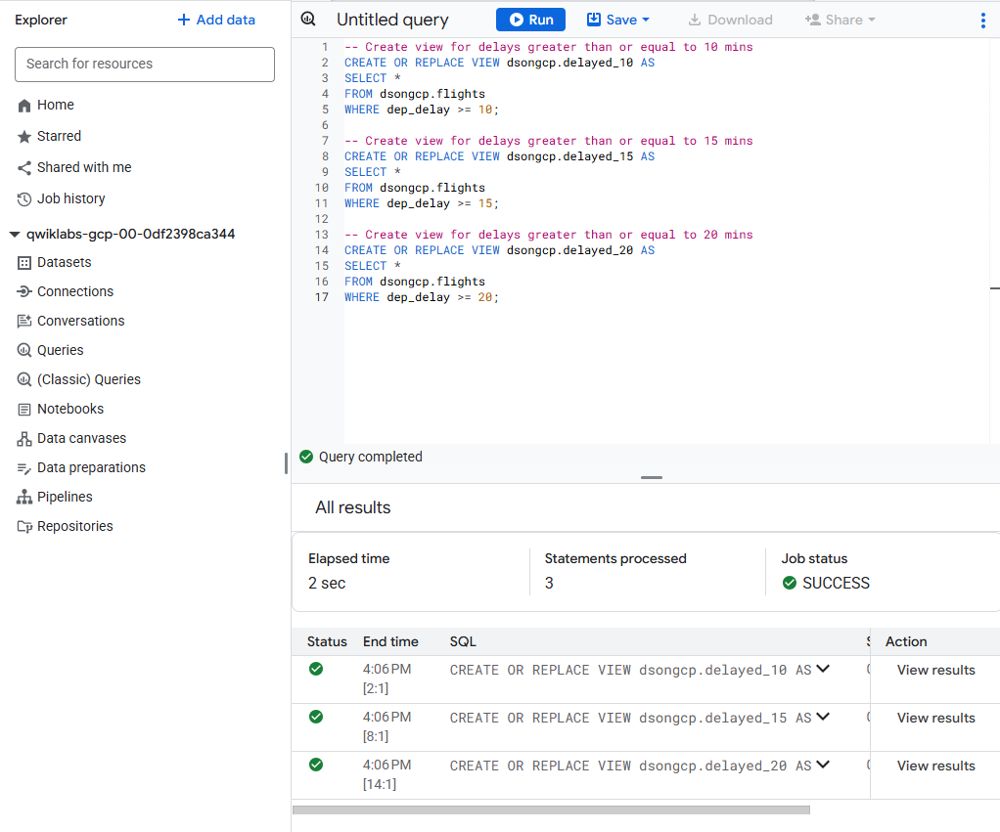
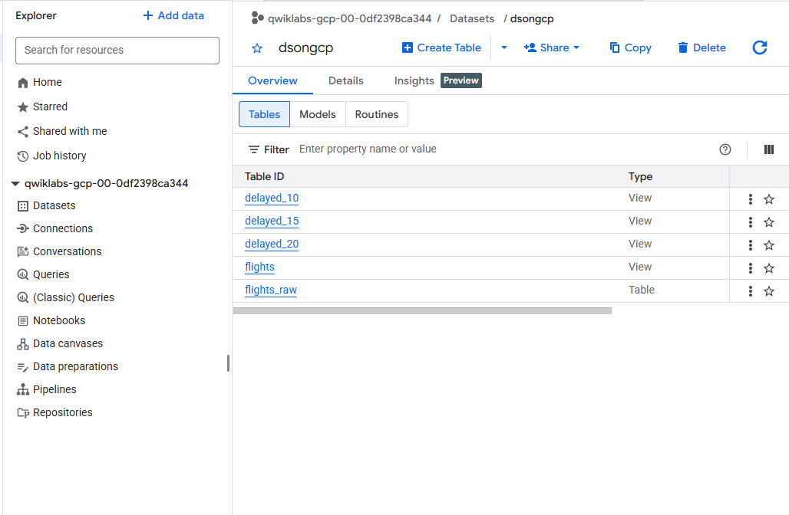
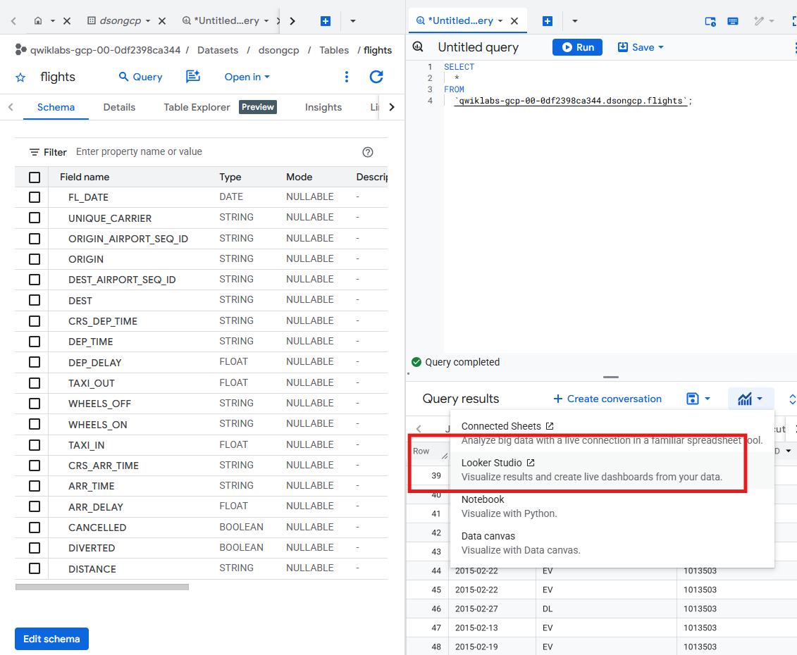
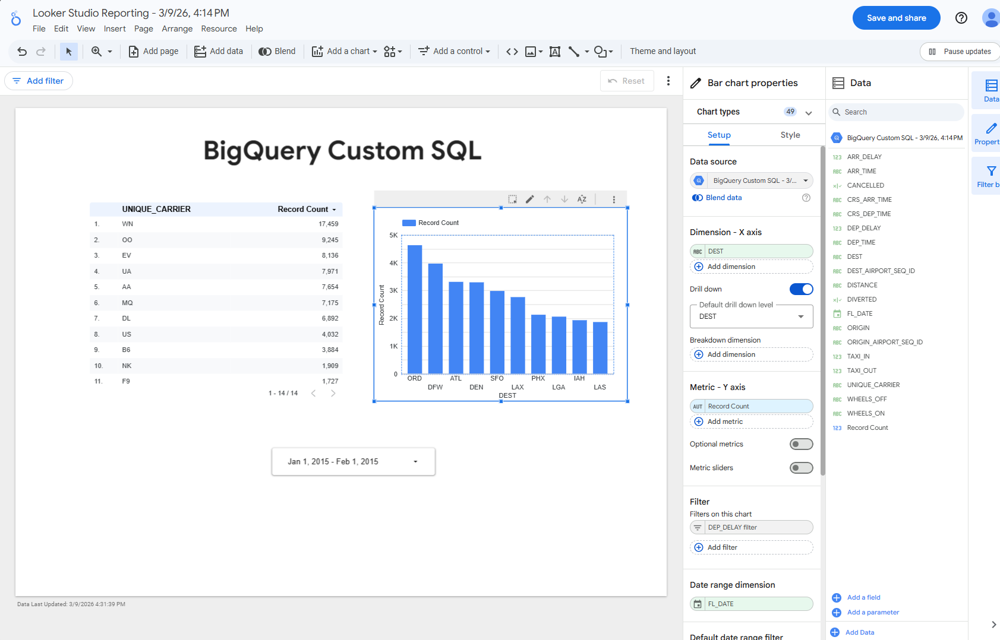
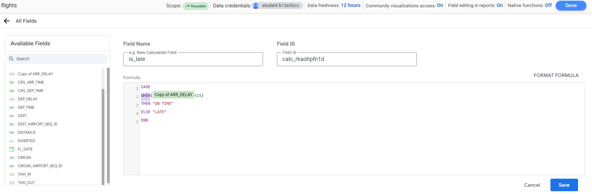
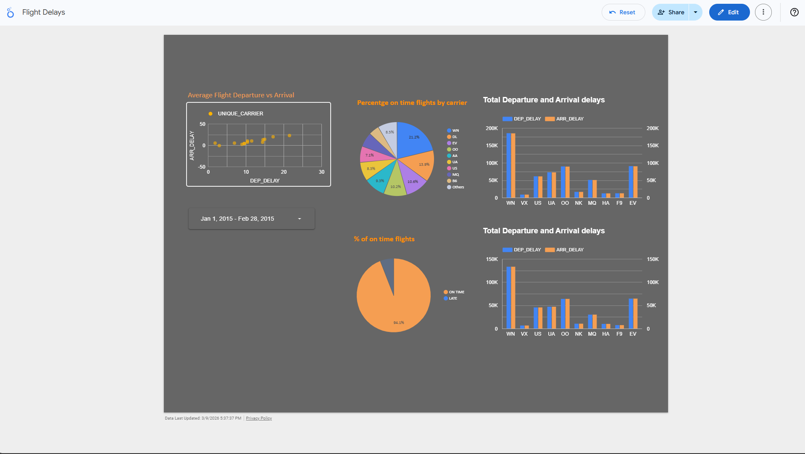

## ✈️ Visualizing BigQuery Data with Looker Studio

## Project Overview
##### This project demonstrates how to build a **data analytics and visualization workflow using Google BigQuery and Looker Studio**.
##### Using historical **U.S. flight data from the Bureau of Transportation Statistics**, we analyze flight delays and visualize insights through interactive dashboards.

### The project shows how cloud data platforms can be used to:
- Transform raw datasets
- Create analytical views
- Build visual dashboards
- Generate actionable business insights

---

# Objective:
#### The objective of this lab is to build a **data analytics pipeline using BigQuery and Looker Studio** to analyze airline flight delay patterns.

Key goals include:

- Transforming raw flight data using **BigQuery SQL views**
- Connecting **BigQuery datasets to Looker Studio**
- Building interactive **data visualizations and dashboards**
- Analyzing **flight delay trends across airlines**

---

# Dataset
#### **Source:**  : US Bureau of Transportation Statistics

#### **Dataset:**  : `dsongcp.flights_raw`

#### **Time Range:**  : January 2015 – February 2015

**Key Fields**

| Field | Description |
|------|-------------|
| FL_DATE | Flight date |
| UNIQUE_CARRIER | Airline carrier |
| ORIGIN | Departure airport |
| DEST | Destination airport |
| DEP_DELAY | Departure delay |
| ARR_DELAY | Arrival delay |
| DISTANCE | Flight distance |

---

# Business Questions
  - This project answers the following analytical questions:

1. Which airlines experience the **highest departure and arrival delays**?
2. What is the **relationship between departure delay and arrival delay**?
3. What percentage of flights are **on time vs delayed**?
4. How do **delay thresholds (10, 15, 20 minutes)** impact flight performance?
5. Which airlines consistently experience **higher average delays**?

---

# Data Architecture
The workflow follows a **Cloud Data Analytics pipeline**.
Raw Data → BigQuery Table → BigQuery Views → Looker Studio → Interactive Dashboard

### Components

| Component | Purpose |
|----------|--------|
| BigQuery | Data storage and SQL transformations |
| BigQuery Views | Analytical datasets for visualization |
| Looker Studio | Dashboard creation |
| Scatter / Pie / Bar Charts | Data insights and reporting |

---

## BigQuery Data Transformation 
  - The raw flight dataset was transformed using **SQL views**.

## Create Flights View

CREATE OR REPLACE VIEW dsongcp.flights AS
SELECT
  FlightDate AS FL_DATE,
  Reporting_Airline AS UNIQUE_CARRIER,
  Origin AS ORIGIN,
  Dest AS DEST,
  CAST(DepDelay AS FLOAT64) AS DEP_DELAY,
  CAST(ArrDelay AS FLOAT64) AS ARR_DELAY,
  DISTANCE
FROM dsongcp.flights_raw;

#### View Schema:

## Create Delay Threshold Views:
  - Flights delayed by 10,20,30 minutes

### Flight Delay Views and Schema: delyed by 20 min,

##### These views simplify downstream analysis by filtering flights based on delay thresholds.

### Views created:

## Data Visualization with Looker Studio on Bigquery:
- The BigQuery dataset was connected to Looker Studio to build an interactive analytics dashboard.

#### Looker studio can be directly connected from Bigquery or Big query data tables can be accessed from Looker studio data sources connectivity.
###### Bigquery connection : 

#### Visualization:

## Looker Studio Dashboard Components:
### 1️⃣ Scatter Plot – Delay Correlation
  - Visualizes the relationship between departure delay and arrival delay.

#### Dimension : UNIQUE_CARRIER
#### Metrics   : AVG(DEP_DELAY) , AVG(ARR_DELAY)

#### Insight:
  - Airlines with high departure delays typically also experience high arrival delays.

### 2️⃣ Pie Chart – On-Time vs Late Flights
  - calculated field was created to classify flights.

#### Calculated Field
CASE 
WHEN ARR_DELAY < 15 THEN "ON TIME"
ELSE "LATE"
END

##### This visualization shows the percentage of flights that arrive on time.

Pie Chart Example

### 3️⃣ Bar Chart – Airline Delay Comparison
  - Compares average delays across airlines.

#### Dimension : UNIQUE_CARRIER
#### Metrics : AVG(DEP_DELAY) , AVG(ARR_DELAY)

#### Insight:
  - Some airlines consistently experience higher delays than others.

## Interactive Dashboard Features

#### The dashboard includes:
  - Date range filter
  - Interactive charts
  - Dynamic data exploration
  - Real-time filtering
  - Users can select a time period and instantly view updated analytics.
    

## Analysis & Key Insights
### From the analysis we observed:
#### 1️⃣ Departure delays strongly correlate with arrival delays
        - Flights departing late are likely to arrive late.

#### 2️⃣ Airline performance varies significantly
        - Some carriers have consistently higher delay averages.

#### 3️⃣ Majority of flights arrive on time
        - However, delay thresholds increase rapidly during peak travel periods.

#### 4️⃣ Delay thresholds highlight operational risk
        - Flights delayed more than 15–20 minutes indicate operational bottlenecks.

## Reporting & Business Value
### The dashboard enables stakeholders to:
  - Monitor airline operational performance
  - Identify delay patterns
  - Compare airline reliability
  - Improve scheduling decisions

### This type of analytics solution can be used by:
  - Airline operations teams
  - Airport management
  - Transportation analysts
  - Aviation regulators

## Technologies Used
### Tool	                                 Purpose
Google BigQuery	                     Data warehouse and SQL analytics
Looker Studio	                       Data visualization
SQL	                                 Data transformation
Google Cloud	                       Cloud analytics platform

### Future Improvements
#### Potential enhancements for this project:
    - Add geographic flight route maps
    - Implement predictive delay modeling
    - Add real-time flight data ingestion
    - Build a machine learning delay prediction model

## Author
### Divya Shetty
### Data Analytics | Cloud Data | Generative AI

#### GitHub: 
##### https://github.com/divya-gh

#### LinkedIn:
#### https://linkedin.com/in/divya-shetty-k

